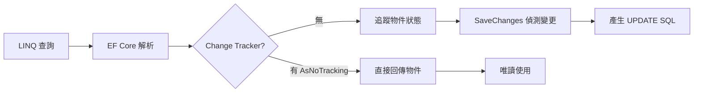

# EF Core 效能技巧

## 查詢生命週期



## AsNoTracking

查詢只用來讀取、不需要更新的資料，一定要加 `AsNoTracking()`，省掉 Change Tracker 的開銷：

```csharp
// 壞的：Change Tracker 會追蹤每一筆回來的物件
var products = await db.Products.Where(p => p.IsActive).ToListAsync();

// 好的：唯讀查詢不需要追蹤
var products = await db.Products
    .Where(p => p.IsActive)
    .AsNoTracking()
    .ToListAsync();
```

如果整個 DbContext 都是唯讀用途（例如報表服務），直接在 `OnConfiguring` 設定：

```csharp
optionsBuilder.UseQueryTrackingBehavior(QueryTrackingBehavior.NoTracking);
```

## Select 只拿需要的欄位

避免 `SELECT *`，只取用到的欄位，減少網路傳輸和記憶體使用：

```csharp
// 壞的：把整個 Order 物件都撈回來
var orders = await db.Orders.Include(o => o.Customer).ToListAsync();

// 好的：只拿畫面需要的欄位
var orders = await db.Orders
    .Select(o => new OrderSummaryDto
    {
        OrderId = o.Id,
        CustomerName = o.Customer.Name,
        Total = o.Total,
        CreatedAt = o.CreatedAt
    })
    .AsNoTracking()
    .ToListAsync();
```

## 避免在迴圈裡查詢

```csharp
// 壞的：N+1，每個 orderId 都打一次 DB
var results = new List<Order>();
foreach (var id in orderIds)
{
    results.Add(await db.Orders.FindAsync(id));
}

// 好的：一次撈完
var results = await db.Orders
    .Where(o => orderIds.Contains(o.Id))
    .ToListAsync();
```

## Split Query

一對多的 `Include` 在資料量大時會產生巨大的 Cartesian Product，改用 Split Query：

```csharp
// 預設：一個 JOIN 查詢，Order 有 100 筆、每筆有 50 個 Item → 5000 行
var orders = await db.Orders
    .Include(o => o.Items)
    .Include(o => o.Tags)
    .ToListAsync();

// Split Query：拆成多個查詢，各自返回合理的資料量
var orders = await db.Orders
    .Include(o => o.Items)
    .Include(o => o.Tags)
    .AsSplitQuery()
    .ToListAsync();
```

> Split Query 會用多次查詢，適合 collection navigation property 資料量大的情況。單純的 many-to-one（`Include` 單一物件）不需要。

## Bulk 操作（EF Core 7+）

EF Core 7 以前的批次更新/刪除會先把資料撈回來再一筆一筆處理，EF Core 7 加入了直接轉成單一 SQL 的 `ExecuteUpdateAsync` 和 `ExecuteDeleteAsync`：

```csharp
// 舊做法：撈回來再改，N 次 UPDATE
var orders = await db.Orders.Where(o => o.Status == "Pending").ToListAsync();
foreach (var o in orders) o.Status = "Cancelled";
await db.SaveChangesAsync();

// EF Core 7+：直接一條 UPDATE SQL
await db.Orders
    .Where(o => o.Status == "Pending")
    .ExecuteUpdateAsync(s => s.SetProperty(o => o.Status, "Cancelled"));

// 直接一條 DELETE SQL
await db.Orders
    .Where(o => o.CreatedAt < DateTime.UtcNow.AddYears(-3))
    .ExecuteDeleteAsync();
```

## Compiled Query

頻繁執行的固定查詢可以預先編譯，省掉每次的 LINQ 解析開銷：

```csharp
private static readonly Func<AppDbContext, int, Task<Order?>> GetOrderById =
    EF.CompileAsyncQuery((AppDbContext db, int id) =>
        db.Orders
            .AsNoTracking()
            .Include(o => o.Items)
            .FirstOrDefault(o => o.Id == id));

// 使用
var order = await GetOrderById(db, orderId);
```
