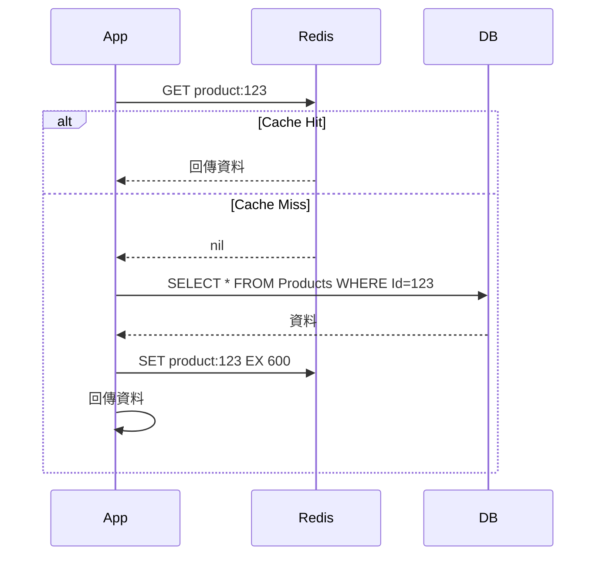
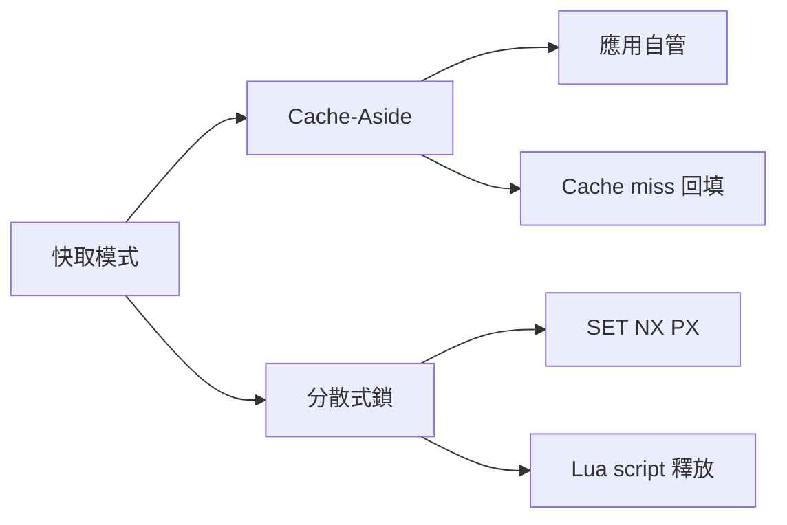

# Redis 快取模式

## Cache-Aside（最常用）

應用程式自己管快取，Cache miss 時從 DB 撈並寫入：




```csharp
public async Task<Product?> GetProductAsync(int id)
{
    var key = $"product:{id}";

    // 1. 先查 Redis
    var cached = await _redis.GetAsync<Product>(key);
    if (cached is not null)
        return cached;

    // 2. Cache miss → 查 DB
    var product = await _db.Products.FindAsync(id);
    if (product is null)
        return null;

    // 3. 寫入 Redis，設 TTL
    await _redis.SetAsync(key, product, TimeSpan.FromMinutes(10));
    return product;
}
```

失效策略：資料更新時主動刪除 key（`DEL product:123`），讓下次自動回填。

## 防止 Cache Stampede

大量請求同時 cache miss，瞬間全打到 DB：

```csharp
// 用 SemaphoreSlim 讓同一個 key 只有一個請求打 DB
private readonly ConcurrentDictionary<string, SemaphoreSlim> _locks = new();

public async Task<T?> GetOrCreateAsync<T>(string key, Func<Task<T?>> factory, TimeSpan ttl)
{
    var cached = await _redis.GetAsync<T>(key);
    if (cached is not null) return cached;

    var semaphore = _locks.GetOrAdd(key, _ => new SemaphoreSlim(1, 1));
    await semaphore.WaitAsync();
    try
    {
        // Double-check：進來之後可能已經有人寫好了
        cached = await _redis.GetAsync<T>(key);
        if (cached is not null) return cached;

        var value = await factory();
        if (value is not null)
            await _redis.SetAsync(key, value, ttl);
        return value;
    }
    finally
    {
        semaphore.Release();
    }
}
```

## 分散式鎖

用 Redlock 避免多個實例同時執行同一個任務：

```csharp
// 使用 StackExchange.Redis
var key = "lock:process-orders";
var lockValue = Guid.NewGuid().ToString();
var ttl = TimeSpan.FromSeconds(30);

// 取鎖：SET key value NX PX 30000
bool acquired = await _db.StringSetAsync(
    key, lockValue,
    ttl,
    When.NotExists);

if (!acquired)
{
    // 別的實例持有鎖，跳過這次執行
    return;
}

try
{
    await ProcessOrdersAsync();
}
finally
{
    // 釋放鎖：用 Lua script 確保只刪自己的鎖
    const string script = @"
        if redis.call('get', KEYS[1]) == ARGV[1] then
            return redis.call('del', KEYS[1])
        else
            return 0
        end";

    await _db.ScriptEvaluateAsync(script, [key], [lockValue]);
}
```

## 常見的 Key 命名規範

```
# 格式：{service}:{entity}:{id}:{field}
product:detail:123
product:list:category:5:page:1
user:session:abc123
order:status:456

# 避免用空格和特殊字元
# 避免 key 太長（影響記憶體和網路）
```

## 各模式比較



## 記憶體淘汰策略

```bash
# redis.conf
maxmemory 2gb
maxmemory-policy allkeys-lru   # 快取場景用這個
# maxmemory-policy volatile-lru  # 只淘汰有設 TTL 的 key
# maxmemory-policy noeviction    # 寫滿就報錯，適合 session store
```

> 快取場景用 `allkeys-lru`，Session 或 Queue 不能丟資料的用 `noeviction`。
