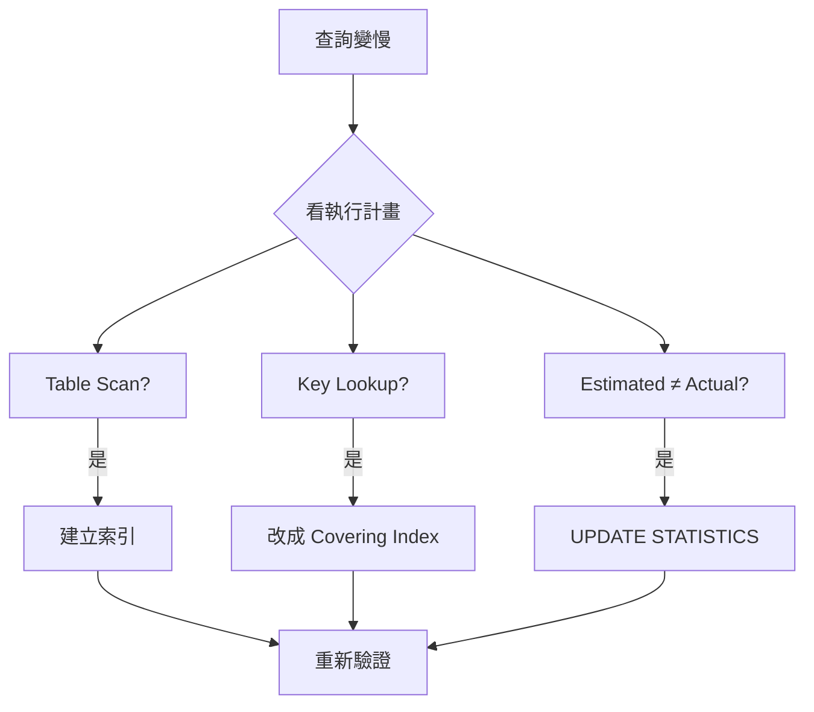

# SQL 查詢效能調校

## 效能調校流程



## 先看執行計畫，再猜問題

優化之前一定要看 Execution Plan，不要憑感覺。

```sql
-- SQL Server
SET STATISTICS IO, TIME ON;
SELECT * FROM Orders WHERE CustomerId = 123;

-- 或直接看圖形化計畫
-- SSMS → 查詢 → 包含實際執行計畫 (Ctrl+M)
```

重點看這幾個：
- **Table Scan / Index Scan** → 通常是沒走索引的訊號
- **Key Lookup** → 索引有走但欄位不夠，需要回 Clustered Index 撈資料
- **Estimated vs Actual Rows** 差很多 → 統計資料過舊，跑 `UPDATE STATISTICS`

## 索引設計原則

### Covering Index

讓查詢需要的欄位全在索引裡，避免 Key Lookup：

```sql
-- 查詢
SELECT OrderId, Total, Status
FROM Orders
WHERE CustomerId = 123 AND Status = 'Pending';

-- 壞的：只對 CustomerId 建索引，Status 和 Total 需要回表
CREATE INDEX IX_Orders_CustomerId ON Orders (CustomerId);

-- 好的：把 Status 加進 key，Total 用 INCLUDE
CREATE INDEX IX_Orders_CustomerId_Status
ON Orders (CustomerId, Status)
INCLUDE (Total);
```

### 複合索引的欄位順序

**選擇性高的欄位放前面**，但等號條件要在範圍條件之前：

```sql
-- WHERE CustomerId = ? AND CreatedAt >= ? AND CreatedAt < ?
-- CustomerId 選擇性高（等號）→ 放第一
-- CreatedAt 範圍查詢 → 放第二
CREATE INDEX IX_Orders_Customer_Date
ON Orders (CustomerId, CreatedAt);
```

## N+1 問題

ORM 最常見的效能殺手，一個列表查詢變成 N+1 次 SQL：

```csharp
// 壞的：每個 Order 都額外查一次 Customer
var orders = await db.Orders.ToListAsync();
foreach (var order in orders)
{
    var customer = await db.Customers.FindAsync(order.CustomerId); // N 次！
}

// 好的：JOIN 一次撈完
var orders = await db.Orders
    .Include(o => o.Customer)
    .ToListAsync();

// 或者明確 projection，只拿需要的欄位
var orders = await db.Orders
    .Select(o => new {
        o.OrderId,
        o.Total,
        CustomerName = o.Customer.Name
    })
    .ToListAsync();
```

## 分頁查詢

用 `OFFSET/FETCH` 在資料量大時會愈翻愈慢，改用 Keyset Pagination：

```sql
-- 傳統分頁：第 10000 頁很痛
SELECT * FROM Orders
ORDER BY CreatedAt DESC
OFFSET 100000 ROWS FETCH NEXT 20 ROWS ONLY;

-- Keyset Pagination：每頁都一樣快
-- 前端傳上一頁最後一筆的 CreatedAt 和 OrderId
SELECT TOP 20 * FROM Orders
WHERE CreatedAt < @LastCreatedAt
   OR (CreatedAt = @LastCreatedAt AND OrderId < @LastOrderId)
ORDER BY CreatedAt DESC, OrderId DESC;
```

## 統計資料更新

查詢計畫不準通常是統計資料舊了：

```sql
-- 更新單一資料表
UPDATE STATISTICS Orders;

-- 更新整個資料庫（維護期間跑）
EXEC sp_updatestats;

-- 查看統計資料上次更新時間
SELECT
    name,
    STATS_DATE(object_id, stats_id) AS LastUpdated
FROM sys.stats
WHERE object_id = OBJECT_ID('Orders');
```
