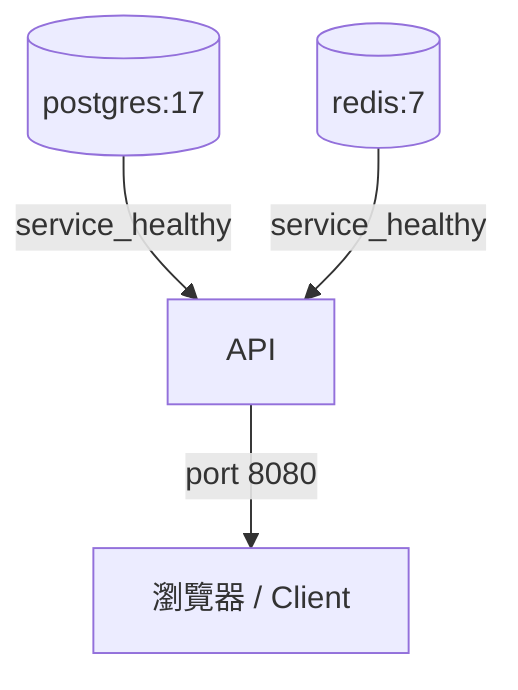

# Docker Compose 實戰筆記

## 服務啟動順序



## 基本結構

```yaml
# compose.yml（新版不用加 version）
services:
  api:
    build: ./src/Api
    ports:
      - "8080:8080"
    environment:
      - ConnectionStrings__Default=Host=db;Database=myapp;Username=app;Password=secret
    depends_on:
      db:
        condition: service_healthy

  db:
    image: postgres:17-alpine
    environment:
      POSTGRES_DB: myapp
      POSTGRES_USER: app
      POSTGRES_PASSWORD: secret
    volumes:
      - pgdata:/var/lib/postgresql/data
    healthcheck:
      test: ["CMD-SHELL", "pg_isready -U app -d myapp"]
      interval: 5s
      timeout: 3s
      retries: 5

volumes:
  pgdata:
```

## 環境變數管理

用 `.env` 搭配 `env_file`，不要把 secret 寫死在 compose 檔裡：

```bash
# .env（加入 .gitignore）
POSTGRES_PASSWORD=my_secret_password
REDIS_PASSWORD=another_secret
```

```yaml
services:
  api:
    env_file:
      - .env
    environment:
      # 也可以混用，這裡的會覆蓋 env_file
      ASPNETCORE_ENVIRONMENT: Development
```

## 多環境設定

```bash
# 開發
docker compose up

# 正式（疊加覆蓋）
docker compose -f compose.yml -f compose.prod.yml up -d
```

```yaml
# compose.prod.yml
services:
  api:
    restart: always
    deploy:
      resources:
        limits:
          memory: 512m
```

## 常用指令

```bash
# 啟動（背景執行）
docker compose up -d

# 重 build 後啟動
docker compose up -d --build

# 查看 log（即時）
docker compose logs -f api

# 進入容器
docker compose exec api sh

# 只重啟某個 service
docker compose restart api

# 清掉所有東西（包含 volume）
docker compose down -v
```

## 健康檢查 + 依賴順序

`depends_on` 預設只等容器啟動，不等服務 ready，要加 `condition`：

```yaml
services:
  api:
    depends_on:
      db:
        condition: service_healthy
      redis:
        condition: service_healthy

  db:
    healthcheck:
      test: ["CMD-SHELL", "pg_isready -U app"]
      interval: 5s
      retries: 5

  redis:
    image: redis:7-alpine
    healthcheck:
      test: ["CMD", "redis-cli", "ping"]
      interval: 5s
      retries: 5
```

## 本地開發用 Watch Mode

```yaml
services:
  api:
    develop:
      watch:
        - action: rebuild
          path: ./src/Api
          ignore:
            - "**/*.md"
```

```bash
docker compose watch
```

> 檔案變動自動重 build，不用每次手動 `down → up --build`。
